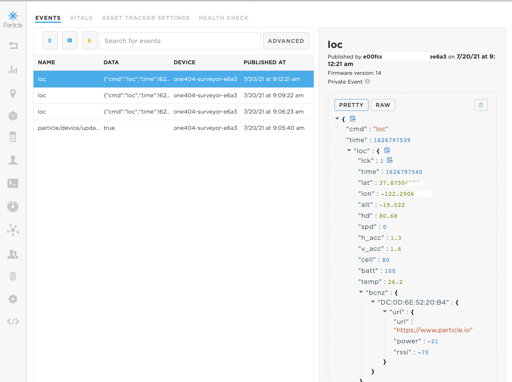

## Tag Surveyor

This Tracker Edge-based demo listens for BLE tags / beacons that advertise
identifying information.  It collects a list of tags it has seen
and forwards that to the Particle Cloud periodically, when the Tracker device has
a geolocation and a Particle Cloud connection. 

In addition, this app can collect temperature and humidity information
from an attached Tracker M8 
[Temperature/Humidity sensor](https://docs.particle.io/datasheets/asset-tracking/m8-temperature-humidity/) 

This app allows you to correlate the location of the Tracker with 
the tags it has seen and the local temperature and humidity conditions. 
This may be useful for eg warehouse or temperature-controlled inventory management.

The full source code is available in the 
[tagsurveyor github repo](https://github.com/tstellanova/tagsurveyor)

Here's a view of how this app reports beacons in the Particle Console:

### Tracker Safe Shipping
Note that for safe shipping purposes, this app supports the Tracker shipping
mode command: From the Particle Console, while the device is connected to
the cloud, you can send the following from the "cmd" function: `{"cmd":"enter_shipping"}`
This will cause the Tracker to power off and disconnect the battery
so that the device will not awaken during shipment. 
Connecting the Tracker to USB 
[will reawaken it](see https://docs.particle.io/tutorials/asset-tracking/setup/#powering-off).
 

# Resources

- [Tracker Edge Latest Release](https://github.com/particle-iot/tracker-edge/releases)
- [Tracker Edge Changelog](CHANGELOG.md)

### CREDITS AND ATTRIBUTIONS

The firmware uses the GNU GCC toolchain for ARM Cortex-M processors, standard peripheral libraries and Arduino's implementation of Wiring.

### LICENSE

Unless stated elsewhere, file headers or otherwise, all files herein are licensed under an Apache License, Version 2.0. For more information, please read the LICENSE file.

If you have questions about software licensing, please contact Particle [support](https://support.particle.io/).

### LICENSE FAQ

**This firmware is released under Apache License, Version 2.0, what does that mean for you?**

 * You may use this commercially to build applications for your devices!  You **DO NOT** need to distribute your object files or the source code of your application under Apache License.  Your source can be released under a non-Apache license.  Your source code belongs to you when you build an application using this reference firmware.

**When am I required to share my code?**

 * You are **NOT required** to share your application firmware binaries, source, or object files when linking against libraries or System Firmware licensed under LGPL.

**Why?**

 * This license allows businesses to confidently build firmware and make devices without risk to their intellectual property, while at the same time helping the community benefit from non-proprietary contributions to the shared reference firmware.

**Questions / Concerns?**

 * Particle intends for this firmware to be commercially useful and safe for our community of makers and enterprises.  Please [Contact Us](https://support.particle.io/) if you have any questions or concerns, or if you require special licensing.

_(Note!  This FAQ isn't meant to be legal advice, if you're unsure, please consult an attorney)_

### COMPILE & FLASH WITH WORKBENCH

This application must be built with device OS version 2.0.0-rc.3 and above.

1. Clone this repository `$ git clone git@github.com:particle-iot/tracker-edge.git && cd ./tracker-edge`
2. Init & Update Submodules `$ git submodule update --init --recursive`
3. Open Particle Workbench
4. Run the `Particle: Import Project` command, follow the prompts, and wait for the project to load
5. Run the `Particle: Configure Workspace for Device` command and select a compatible Device OS version and the `tracker` platform when prompted ([docs](https://docs.particle.io/tutorials/developer-tools/workbench/#cloud-build-and-flash))
6. Connect your device
7. Compile & Flash!

### CONTRIBUTE

Want to contribute to the Particle tracker edge firmware project? Follow [this link](CONTRIBUTING.md) to find out how.

### CONNECT

Having problems or have awesome suggestions? Connect with us [here.](https://community.particle.io/c/tracking-system).

Enterprise customers can contact [support](https://support.particle.io/).
